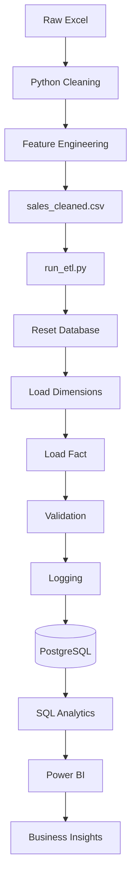

#  Sales Analytics Platform (End-to-End Automation Project)

> **Production-style portfolio project** demonstrating an end-to-end analytics solution using **Python, Pandas, PostgreSQL, SQL, and Power BI**.

> **Author:** Vishnu Mohan

---

# Table of Contents
1. Project Overview
2. Business Problem
3. Objectives
4. Technology Stack
5. Architecture
6. Project Workflow
7. Folder Structure
8. Dataset
9. Data Cleaning & Feature Engineering
10. Data Warehouse
11. ETL Pipeline
12. SQL Analytics
13. Power BI Dashboard
14. Automation
15. Validation
16. Installation
17. How to Run
18. Screenshots
19. Sample SQL
20. Sample Python
21. Skills Demonstrated
22. Results
23. Future Improvements


# Project Overview
This project simulates a real-world Sales Analytics Platform that automates the complete workflow from raw Excel sales data to an executive Power BI dashboard. The solution includes data cleaning, feature engineering, dimensional modeling, ETL automation, SQL analytics, and dashboard reporting.

# Business Problem
Many organizations rely on Excel-based sales reports that require repetitive manual processing. This project automates ingestion, cleaning, warehouse loading, validation, and reporting to improve consistency and reduce manual effort.

# Objectives
- Automate ETL
- Improve data quality
- Build a Star Schema warehouse
- Create reusable Python modules
- Perform business SQL analytics
- Build an Executive Power BI dashboard
- Generate logs and validation reports

# Technology Stack

| Area | Technology |
|---|---|
| Programming | Python |
| Processing | Pandas |
| Database | PostgreSQL |
| SQL | PostgreSQL SQL |
| BI | Power BI |
| IDE | VS Code |
| Version Control | Git & GitHub |

# Architecture



# Project Workflow
1. Read Excel
2. Clean data
3. Feature engineering
4. Export cleaned CSV
5. Reset database
6. Load dimensions
7. Load fact
8. Validate
9. Log execution
10. Build Power BI dashboard

# Folder Structure

```text
Sales Analytics Platform/
├── data/
│   ├── raw/
│   └── cleaned/
├── python/
│   ├── exploration/
│   ├── analysis/
│   ├── database/
│   ├── etl/
│   └── automation/
├── sql/
├── powerbi/
├── reports/
├── logs/
└── README.md
```

Describe each folder briefly in your repository.

# Dataset
- ~9,994 sales records
- Customers, Products, Orders, Geography
- Sales, Profit, Discount, Quantity

# Data Cleaning
- Missing values
- Duplicate handling
- Data type validation
- Outlier detection (IQR)
- Business rule validation

## Feature Engineering
- Order Year
- Order Month
- Month Number
- Quarter
- Day Name
- Shipping Days
- Profit Margin
- Loss Order

# Data Warehouse
Star Schema:
- dim_customer
- dim_product
- dim_location
- dim_ship_mode
- dim_date
- fact_sales

# ETL Pipeline
Scripts:
- load_dim_customer.py
- load_dim_product.py
- load_dim_location.py
- load_dim_ship_mode.py
- load_dim_date.py
- load_fact_sales.py
- run_etl.py
- reset_database.py
- validate_database.py
- logger.py

# SQL Analytics
Implemented:
- Aggregations
- CTEs
- Window Functions
- ROW_NUMBER()
- DENSE_RANK()
- LAG()
- Running Totals
- YoY
- MoM
- Rankings


# Power BI Dashboard

KPIs:
- Total Sales
- Total Profit
- Orders
- Quantity
- Avg Sales
- Avg Profit
- Profit Margin %
- YoY %
- MoM %

Visuals:
- KPI Cards
- Monthly Trend
- Region Analysis
- Category Analysis
- Segment Analysis
- Top Products
- Top Customers

# Automation
Pipeline execution:
- Reset DB
- Load dimensions
- Load fact
- Validate
- Log completion

Execution time: ~36 seconds.

# Validation

|Table|Rows|
|---|---:|
|dim_customer|793|
|dim_product|1862|
|dim_location|632|
|dim_ship_mode|4|
|dim_date|1237|
|fact_sales|9994|


Configure PostgreSQL connection in `db_connection.py`.

# How to Run

```bash
python python/automation/run_etl.py
```

Open the Power BI report after successful loading.

# Screenshots

## Executive Dashboard
> https://github.com/vishnu-mohan29/Sales-Analytics-Platform/blob/main/Screenshot%20(207).png

## Star Schema
> https://github.com/vishnu-mohan29/Sales-Analytics-Platform/blob/main/Screenshot%20(208).png

## SQL(https://github.com/vishnu-mohan29/Sales-Analytics-Platform/blob/main/business_analysis.sql)
> Add SQL query screenshots.

## Automation Log
> Add execution log screenshot.

# Sample Python

```python
from database.db_connection import create_connection

conn=create_connection()
print("Connected!")
conn.close()
```

# Skills Demonstrated
- Python
- Pandas
- SQL
- PostgreSQL
- ETL
- Data Warehousing
- Power BI
- DAX
- Automation
- Logging
- Validation
- GitHub

# Results
- Built a reusable ETL pipeline.
- Automated warehouse loading.
- Delivered executive dashboards.
- Improved repeatability through validation and logging.

# Future Improvements
- Incremental loading
- Unit testing
- Configuration file
- Email alerts
- CI/CD

